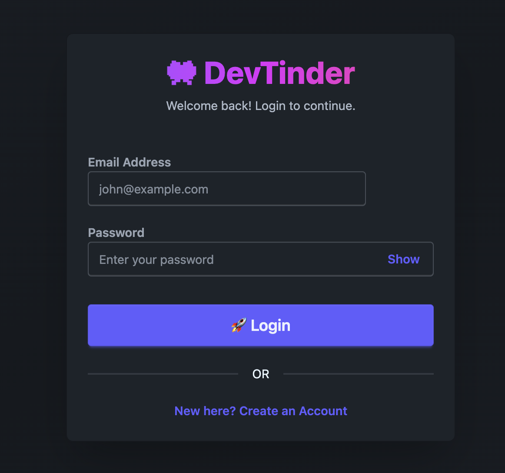
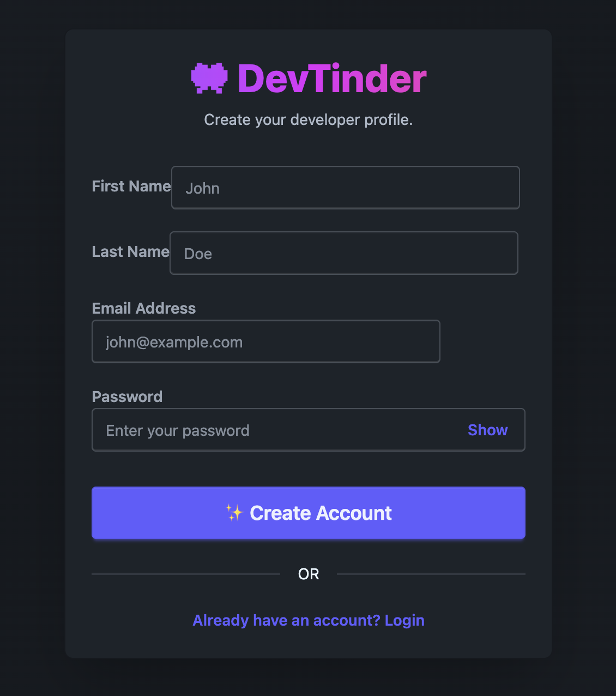
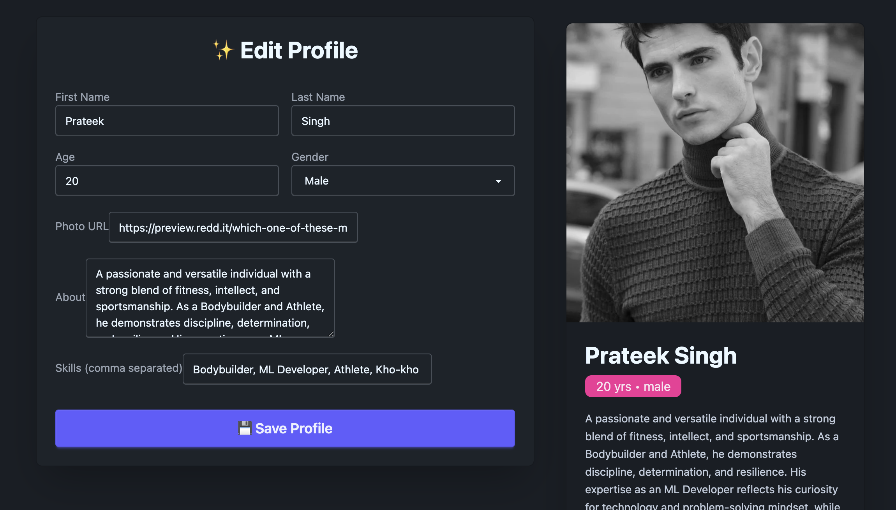
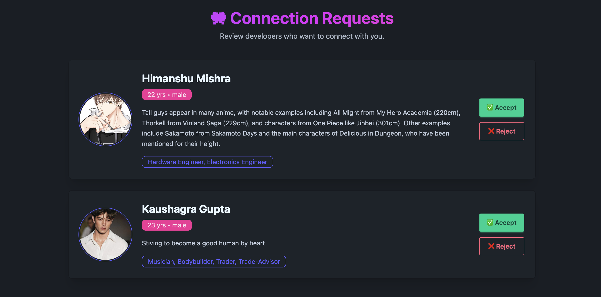
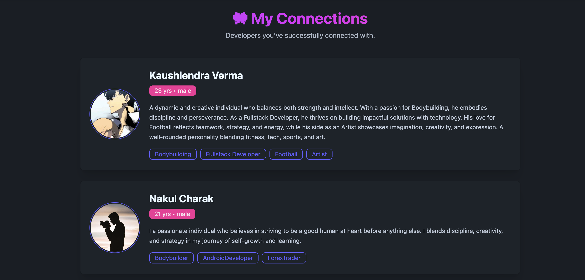
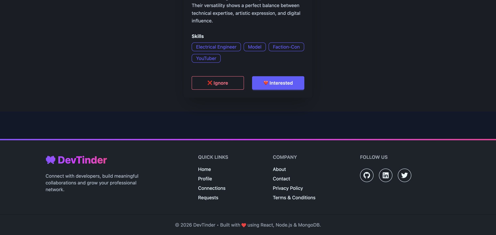

# 👩🏻‍💻 DevTinder Frontend

A modern developer networking platform inspired by Tinder, where developers can discover, connect, and collaborate with each other.

Built using **React**, **Vite**, **Redux Toolkit**, **Tailwind CSS**, and **DaisyUI**, the application provides a responsive and intuitive user experience with secure authentication and real-time profile management.

---

## 🚀 Live Demo

Frontend: **Coming Soon**

Backend: **Coming Soon**

---

## 📸 Features

* 🔐 Secure Login & Sign Up
* 👤 Edit and manage developer profile
* 🖼️ Live profile preview while editing
* 🔥 Discover developers through the feed
* ❤️ Send connection requests
* 🤝 Accept or reject connection requests
* 👥 View all accepted connections
* 🎨 Modern responsive UI with Tailwind CSS & DaisyUI
* ⚡ Fast performance using Vite
* 🗂️ Global state management with Redux Toolkit
* 🍪 Cookie-based authentication
* 📱 Mobile-friendly design

---

## 🛠️ Tech Stack

### Frontend

* React 19
* Vite
* React Router DOM
* Redux Toolkit
* React Redux
* Axios
* Tailwind CSS
* DaisyUI
* React Icons

### Backend

This frontend communicates with a separate Node.js backend built using:

* Node.js
* Express.js
* MongoDB
* Mongoose
* JWT Authentication
* Cookie Parser

---

## 📂 Project Structure

```text
src/
│
├── components/
│   ├── core/
│   │   ├── Navbar.jsx
│   │   ├── Footer.jsx
│   │   └── Body.jsx
│   │
│   ├── features/
│   │   ├── Feed.jsx
│   │   ├── Login.jsx
│   │   ├── EditProfile.jsx
│   │   ├── Connection.jsx
│   │   └── Request.jsx
│   │
│   └── UI/
│       └── UserCard.jsx
│
├── utils/
│   ├── appStore.js
│   ├── constants.js
│   ├── userSlice.js
│   ├── feedSlice.js
│   ├── connectionSlice.js
│   └── requestSlice.js
│
├── App.jsx
└── main.jsx
```

---

## ⚙️ Installation

Clone the repository

```bash
git clone https://github.com/<your-username>/devtinder-web.git
```

Move into the project

```bash
cd devtinder-web
```

Install dependencies

```bash
npm install
```

Start the development server

```bash
npm run dev
```

The application will start on

```text
http://localhost:5173
```

---

## 🔧 Environment Variables

Create a `.env` file in the project root.

```env
VITE_API_URL=http://localhost:7777
```

For production

```env
VITE_API_URL=https://your-render-backend.onrender.com
```

---

## 📌 Available Scripts

Run development server

```bash
npm run dev
```

Build for production

```bash
npm run build
```

Preview production build

```bash
npm run preview
```

Lint the project

```bash
npm run lint
```

---

## 🎯 Application Flow

```text
Login / Sign Up
        │
        ▼
Developer Feed
        │
        ▼
Send Connection Request
        │
        ▼
Receiver Reviews Request
        │
        ├───────────────┐
        ▼               ▼
Accept            Reject
        │
        ▼
Connections List
```

---

## 📷 Screens

## 📸 Application Screenshots

### 🔐 Login Page

Modern authentication page with responsive UI, password visibility toggle, and secure login.

<p align="center">
  
</p>

---

### ✨ Sign Up Page

Create a new developer account with a clean and intuitive registration interface.

<p align="center">
  
</p>

---

### 🔥 Developer Feed

Browse developer profiles, discover new connections, and send connection requests.

<p align="center">
  
</p>

---

### 👤 Edit Profile

Update profile information with a live profile preview.

<p align="center">
  
</p>

---

### 📩 Connection Requests

Accept or reject incoming developer connection requests.

<p align="center">
  
</p>

---

### 🤝 My Connections

View all accepted developer connections with a modern card layout.

<p align="center">
  
</p>

---

### 🎨 Responsive Footer

Modern footer with quick links and social media integration.

<p align="center">
  
</p>
---

## 🔮 Future Enhancements

* 💬 Real-time messaging
* 📹 Video calling
* 🔔 Push notifications
* 🌙 Dark / Light theme toggle
* 🔍 Advanced developer search
* 🧠 AI-based developer recommendations
* 📍 Location-based matching
* ⭐ Profile verification
* 📊 Dashboard & analytics

---

## 🤝 Contributing

Contributions are welcome.

1. Fork the repository
2. Create a feature branch

```bash
git checkout -b feature/new-feature
```

3. Commit your changes

```bash
git commit -m "Added new feature"
```

4. Push your branch

```bash
git push origin feature/new-feature
```

5. Open a Pull Request

---

## 👨‍💻 Author

**Kaushlendra Kumar Verma**

* GitHub: https://github.com/<your-github-username>
* LinkedIn: https://linkedin.com/in/<your-linkedin>

---

## 📄 License

This project is licensed under the MIT License.

---

## ⭐ Support

If you found this project helpful, consider giving it a ⭐ on GitHub. It helps others discover the project and supports future improvements.
